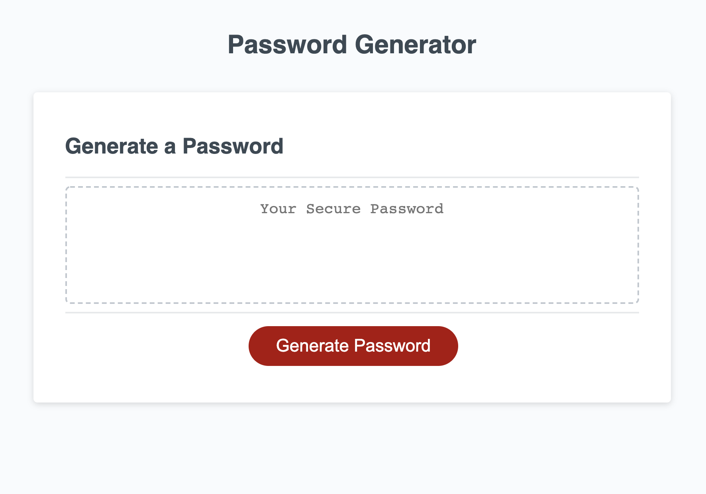

# HW_3_Password_Generator

This assignment focused on using our newly acquired knowledge of javascript to generate a random password while dynamaically updating the HTML file. The generator accomplishes this task by asking a series of prompts, checks to make sure answers match password critera, and display the password onto the page. The application adapts to multiple screen sizes.

